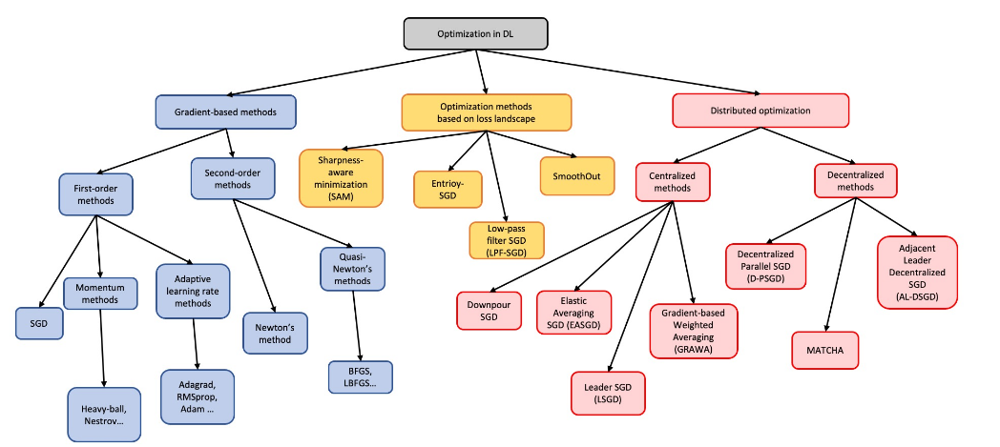

# 深度学习优化综述
[A Survey of Optimization Methods for Training DL Models: Theoretical Perspective on Convergence and Generalization](https://arxiv.org/pdf/2501.14458)：本文对深度学习优化方法的理论基础进行了广泛的总结，包括介绍各种方法、其收敛性分析和泛化能力，并为本调查论文中考虑的优化算法提供凸和非凸分析。

### 注意点
虽然现有文献包含大量专为深度学习应用设计的优化技术，但深度学习优化理论仍然存在明显的差距，故本文是对优化方法的理论基础进行的总结。若基于理论算法进行思考优化，可以进行参考。

## 一、基于梯度的优化方法（Gradient-based optimization methods）
这类方法是深度学习优化的核心基础范式，核心是利用导数（梯度）信息迭代更新参数；根据所使用的导数阶数，主要分为一阶方法与二阶方法两大类。

### 1. 一阶方法（First-order methods）
仅使用一阶导数（梯度）更新参数，单步计算成本低，是深度网络训练的主流方案。其随机化版本（以SGD为核心）通过单样本/小批量样本估计梯度，大幅降低了大规模数据集、复杂模型架构带来的计算负担。

除降低计算开销外，梯度中的随机扰动还具备额外优化价值：
- 随机扰动能够帮助一阶方法逃离鞍点——损失曲面上易导致优化停滞的平坦区域；
- 一类研究方向将**朗之万动力学（Langevin Dynamics）** 融入一阶优化，从理论基础与工程实现两个层面展开，验证了噪声机制在提升收敛速度、增强优化鲁棒性上的潜力。

一阶方法主要分为三个子类：
- **基础SGD（随机梯度下降）**：最原始的梯度下降随机变体，用单样本或小批量估计全局梯度，是所有一阶变体算法的基础。
- **动量类方法（Momentum methods）**：引入历史梯度的“惯性”累积，在加速收敛的同时缓解梯度震荡，提升优化稳定性。
  - 代表算法：Heavy-ball（重球法）、Nesterov（NAG，内斯特罗夫加速梯度）
- **自适应学习率方法（Adaptive learning rate methods）**：根据梯度的历史迭代信息，为每个参数自动调整适配的学习率，显著降低人工调参难度。
  - 代表算法：Adagrad、RMSprop、Adam 等

### 2. 二阶方法（Second-order methods）
利用二阶导数信息（如海森矩阵 Hessian）指导优化的搜索方向，迭代收敛速度显著快于一阶方法，但计算与存储成本远高于一阶方法。
- 经典的**牛顿法（Newton's method）**在非凸假设下可实现二次收敛速度，远快于一阶梯度下降的线性收敛速度；但高维场景下直接计算海森矩阵及其逆的开销极高，难以直接应用于深度学习。
- 为降低二阶方法的时间与空间复杂度，衍生出一系列近似方案：
  - **拟牛顿法（Quasi-Newton's methods）**：通过迭代方式近似海森矩阵的逆，无需直接计算完整海森矩阵，代表算法有BFGS、LBFGS（有限内存BFGS）；
  - Hessian-free 算法：通过经验性近似规避完整海森计算，是二阶方法在深度学习中的主流落地形式。

> 补充说明：**分布式优化（Distributed optimization）** 是与「基于梯度的方法」并列的独立优化分支，核心解决大规模场景下的并行训练问题，并不隶属于梯度方法，整体下分中心化与去中心化两类架构。

## 二、主流优化方法的理论性质对比
现有研究从**收敛速率**与**泛化误差界**两个核心维度，对不同类别的优化方法做了系统的理论对比，对比维度涵盖假设条件、收敛阶、理论上界与实际表现。

### 2.1 收敛速率对比
该对比围绕凸性、利普希茨光滑性、海森有界性、梯度方差、步长策略五类假设，梳理了各方法的理论收敛阶与实际特性。

#### （1）一阶与二阶基础方法
- **一阶方法**：整体均为亚线性收敛，不同假设下收敛阶存在差异
  - SGD 与带动量 SGD（SGD-M）：强凸假设下收敛阶为 $O(\frac{1}{K})$，非凸光滑假设下为 $O(\frac{1}{\sqrt{K}})$；步长随迭代次数反比例衰减。动量项不改变渐近收敛阶，但能提升实际收敛的稳定性与速度。
  - 自适应学习率方法（Adagrad、Adam）：采用恒定/有界衰减的步长策略，理论收敛阶为 $O(\frac{\ln K}{\sqrt{K}})$。尽管理论上难以与SGD直接横向对比收敛速度，但大量实证研究表明，自适应方法在迭代次数和实际训练时间上收敛更快，能在更少迭代内达到更低的训练损失。

- **二阶方法**：迭代层面收敛速度显著快于一阶方法，但单步计算成本极高
  - 牛顿法：具备二次收敛速度；
  - BFGS（拟牛顿法）：具备超线性收敛速度；
  - L-BFGS：凸假设下为 R-线性收敛。
  - 核心局限：海森矩阵（或其近似）的计算与存储开销巨大，在深度学习的大规模数据、大模型场景下，实际运行效率反而低于一阶方法，因此工程应用受限。

#### （2）分布式优化方法
- **中心化分布式方法**（Downpour-SGD、EASGD、LSGD、GRAWA）
  理论上在强凸/非凸光滑假设下，均保持亚线性收敛（$O(\frac{1}{K})$ 或 $O(\frac{1}{\sqrt{K}})$），收敛速率恒定。但实证结果显示，LSGD 与 GRAWA 在时间与迭代维度上收敛更快，且能收敛到质量更优、更平坦的局部极小值。

- **去中心化分布式方法**（D-PSGD、MATCHA、AL-DSGD）
  步长与工作节点数量 $m$ 相关，收敛速率包含与节点数相关的额外项，理论收敛速度慢于中心化方法。其中 AL-DSGD 的理论收敛速度慢于 D-PSGD 与 MATCHA，但三者均为亚线性收敛，且实证上泛化性能相当。

### 2.2 泛化误差界对比
优化方法的泛化能力与损失函数的利普希茨连续性、利普希茨光滑性紧密相关，不同方法可推导得到严格程度不同的泛化误差上界。

- **一阶方法**（SGD、SGD-M）
  在凸/强凸、非凸等不同假设下，均可推导得到对应的泛化误差上界，界的大小与步长、迭代次数、训练样本量直接相关。

- **损失曲面感知类方法**
  - SAM：现有研究暂无严格的理论泛化保证，其泛化优势主要由实证结果支撑；
  - Entropy-SGD、LPF-SGD、SmoothOut：当迭代次数 $K$ 足够大时，这类方法的泛化误差界比普通 SGD 更紧，从理论上验证了“平滑损失曲面、引导模型收敛到平坦极小值”的策略能够带来泛化收益。

## 三、假设（实际与理想）
1. 凸性：深度学习通常处理非凸损失情况。除了BFGS之外，我们提到的所有方法都有非凸假设下的理论保证。 
2. 平滑度：我们列出的所有方法都需要损失函数的平滑度。在实践中，损失函数可能不平滑，特别是在存在噪声或不规则数据分布的情况下。为了解决这个问题，深度学习研究人员使用了提高损失平滑度的技术，其中包括正则化、dropout、批量归一化等。 
3. 方差有界：所有随机方法都假设梯度估计的方差是有界的。在实践中，训练损失函数可能并不总是满足这个假设，特别是在涉及噪声或异构数据的场景中。例如，具有异常值或不平衡类别的数据集可能会导致更高的梯度方差，从而使训练过程复杂化。为了解决这个问题，我们可以实施小批量训练而不是逐点随机训练来平均噪声并稳定梯度估计。实践中确实是这么做的。 
4. 步长：实际中使用的步长常常与收敛证明中的步长不同。例如，在非凸设置的 SGD 和 SGD 动量证明中，我们假设学习率成反比下降 (αt = 1/t)。然而，在实证应用中，过快降低学习率可能会过早终止学习过程，从而导致解决方案不理想。从业者通常采用逐步、线性或余弦退火率，而不是成反比的学习率，这些退火率下降得慢得多。

## 四、定义
1. 若可微函数 $f: \mathbb{R}^n \to \mathbb{R}$ 存在常数 $\mu > 0$，使得对任意 $x, y \in \mathbb{R}^n$ 均满足：$$f(y) \geq f(x) + \nabla f(x)^\top (y-x) + \frac{\mu}{2} \|y-x\|^2$$则称 $f$ 为 $\mu$-强凸函数。